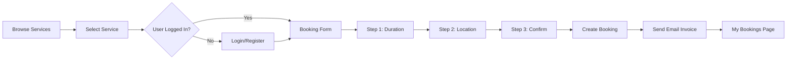

<div align="center">

# 🏡 CareNest

### _Your Trusted Care Service Platform_

[](https://nextjs.org/)
[](https://reactjs.org/)
[](https://firebase.google.com/)
[](https://tailwindcss.com/)
[](https://vercel.com/)

**[🌐 Live Demo](https://carenest-ecru.vercel.app)** • **[👨‍💻 Developer](https://github.com/TusharChow20)** • **[💼 LinkedIn](https://www.linkedin.com/in/tusharchowdhury20211)**

---

### 🎯 _Making Quality Care Services Accessible to Everyone_

CareNest is a modern, full-stack care service booking platform that connects users with professional caregivers for babies, elderly, and sick people. Built with cutting-edge technologies and designed for seamless user experience.

</div>

---

## ✨ Features

<table>
<tr>
<td width="50%">

### 🎨 **User Experience**

- 📱 Fully Responsive Design
- 🎭 Smooth Animations with Framer Motion
- 🌓 Dark Mode Support
- ⚡ Lightning Fast Performance
- 🎯 Intuitive Navigation

</td>
<td width="50%">

### 🔐 **Authentication**

- 📧 Email/Password Authentication
- 🔑 Google Social Login
- 🛡️ Secure Session Management
- 🔄 Persistent Login State
- ✅ Form Validation

</td>
</tr>
<tr>
<td width="50%">

### 📅 **Booking System**

- ⏰ Flexible Duration (Hours/Days)
- 📍 Multi-level Location Selection
- 💰 Real-time Cost Calculation
- 📊 Booking Status Tracking
- 📧 Email Invoice Generation

</td>
<td width="50%">

### 🎯 **Service Management**

- 👶 Baby Care Services
- 👴 Elderly Care Services
- 🏥 Sick People Care Services
- 📄 Detailed Service Pages
- 🔍 Service Overview

</td>
</tr>
</table>

---

## 🚀 Quick Start

### Prerequisites

```bash
node >= 18.0.0
npm >= 9.0.0
```

### Installation

1. **Clone the repository**

```bash
git clone https://github.com/TusharChow20/projectCareNest.git
cd carenest
```

2. **Install dependencies**

```bash
npm install
```

3. **Set up environment variables**

```bash
# Create .env.local file in root directory
cp .env.example .env.local
```

4. **Configure environment variables**

```env
# Firebase Configuration
NEXT_PUBLIC_FIREBASE_API_KEY=your_api_key
NEXT_PUBLIC_FIREBASE_AUTH_DOMAIN=your_auth_domain
NEXT_PUBLIC_FIREBASE_PROJECT_ID=your_project_id
NEXT_PUBLIC_FIREBASE_STORAGE_BUCKET=your_storage_bucket
NEXT_PUBLIC_FIREBASE_MESSAGING_SENDER_ID=your_sender_id
NEXT_PUBLIC_FIREBASE_APP_ID=your_app_id

# Database
DATABASE_URL=your_neon_database_url

# Email Service (Brevo/Nodemailer)
BREVO_API_KEY=your_brevo_api_key
EMAIL_FROM=your_email@domain.com
```

5. **Run development server**

```bash
npm run dev
```

6. **Open your browser**

```
http://localhost:3000
```

---

## 🛣️ Routes & Pages

| Route          | Access     | Description                     |
| -------------- | ---------- | ------------------------------- |
| `/`            | Public     | Homepage with services overview |
| `/service/:id` | Public     | Individual service details      |
| `/booking/:id` | Private 🔒 | Multi-step booking form         |
| `/my-bookings` | Private 🔒 | User's booking management       |
| `/login`       | Public     | User authentication             |
| `/register`    | Public     | New user registration           |
| `*`            | Public     | 404 Error page                  |

---

## 🎯 Booking Flow



---

## 💾 Database Schema

### Bookings Table

```sql
CREATE TABLE bookings (
  id TEXT PRIMARY KEY,
  user_id TEXT NOT NULL,
  user_email TEXT NOT NULL,
  user_name TEXT,
  service_id TEXT NOT NULL,
  service_name TEXT NOT NULL,
  service_icon TEXT,
  duration INTEGER NOT NULL,
  duration_type TEXT NOT NULL,
  location JSONB NOT NULL,
  special_instructions TEXT,
  total_cost INTEGER NOT NULL,
  status TEXT DEFAULT 'Pending',
  created_at TIMESTAMP DEFAULT NOW(),
  updated_at TIMESTAMP DEFAULT NOW()
);
```

---

## 🔧 Technologies Used

<div align="center">

### Frontend


### Backend & Database


### Additional Tools


</div>

---

## 📱 Key Features Breakdown

### 🔐 Authentication System

- Secure email/password authentication with Firebase
- Google OAuth integration for quick sign-in
- Protected routes with automatic redirection
- Persistent session management
- Password validation (6+ characters, uppercase, lowercase)

### 📅 Smart Booking System

- **Step 1: Duration Selection**

  - Choose between hours or days
  - Real-time cost calculation
  - Visual feedback for selections

- **Step 2: Location Details**

  - Hierarchical location selector (Division → District → City → Area)
  - Complete Bangladesh location data
  - Full address input with validation
  - Optional special instructions

- **Step 3: Confirmation**
  - Review all booking details
  - See total cost breakdown
  - One-click confirmation
  - Automatic email invoice

### 📊 Booking Management

- View all bookings in one place
- Filter by status (All, Pending, Confirmed, Completed, Cancelled)
- Cancel pending bookings
- Delete completed/cancelled bookings
- Book same service again
- Beautiful SweetAlert2 confirmations

### 📧 Email Notifications

- Automated booking confirmation emails
- Professional invoice format
- Booking details and summary
- Sent via Brevo/Nodemailer

---

## 🎨 Design Highlights

- **Modern UI/UX**: Clean, intuitive interface with smooth animations
- **Responsive Design**: Optimized for mobile, tablet, and desktop
- **Dark Theme**: Eye-friendly design with proper contrast
- **Loading States**: Engaging loading spinners and skeleton screens
- **Toast Notifications**: Non-intrusive success/error messages
- **Modal Dialogs**: Beautiful SweetAlert2 confirmations

---

## 🚀 Deployment

### Vercel Deployment (Recommended)

1. **Push to GitHub**

```bash
git add .
git commit -m "Ready for deployment"
git push origin main
```

2. **Deploy to Vercel**

- Connect your GitHub repository
- Configure environment variables
- Deploy with one click

### Environment Variables Setup

Make sure to add all environment variables in Vercel dashboard:

- Firebase credentials
- Database URL
- Email service API keys

---

## 📈 Future Enhancements

- [ ] 🔔 Real-time notifications
- [ ] 💬 Chat system between users and caregivers
- [ ] ⭐ Rating and review system
- [ ] 📸 Caregiver profiles with photos
- [ ] 📊 Admin dashboard for service management
- [ ] 💳 Integrated payment gateway
- [ ] 📱 Mobile app (React Native)
- [ ] 🗓️ Calendar view for bookings
- [ ] 🔍 Advanced search and filters
- [ ] 📧 SMS notifications

---

## 🤝 Contributing

Contributions are always welcome! Here's how you can help:

1. Fork the project
2. Create your feature branch (`git checkout -b feature/AmazingFeature`)
3. Commit your changes (`git commit -m 'Add some AmazingFeature'`)
4. Push to the branch (`git push origin feature/AmazingFeature`)
5. Open a Pull Request

---

## 📝 License

This project is licensed under the MIT License - see the [LICENSE](LICENSE) file for details.

---

## 👨‍💻 Developer

<div align="center">

### **Tushar Chowdhury**

[](https://github.com/TusharChow20)
[](https://www.linkedin.com/in/tusharchowdhury20211)

_Full Stack Developer | Next.js Enthusiast | Problem Solver_

</div>

---

## 🙏 Acknowledgments

- [Next.js](https://nextjs.org/) - The React Framework
- [Firebase](https://firebase.google.com/) - Backend as a Service
- [Tailwind CSS](https://tailwindcss.com/) - Utility-first CSS Framework
- [Framer Motion](https://www.framer.com/motion/) - Animation Library
- [SweetAlert2](https://sweetalert2.github.io/) - Beautiful Alerts
- [Lucide Icons](https://lucide.dev/) - Icon Library

---

<div align="center">

### ⭐ Star this repository if you find it helpful!

**Made with ❤️ and ☕ by Tushar Chowdhury**

</div>
